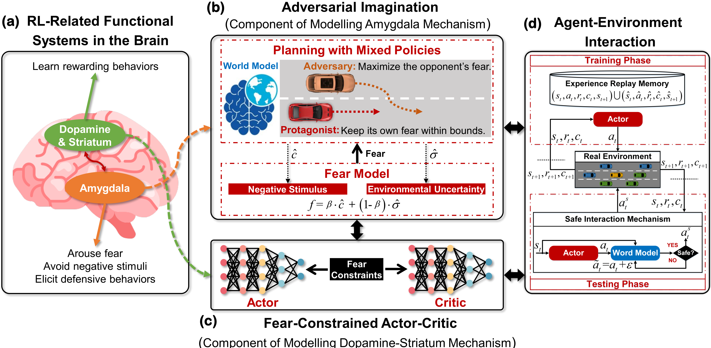
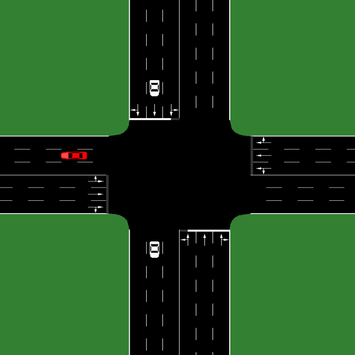
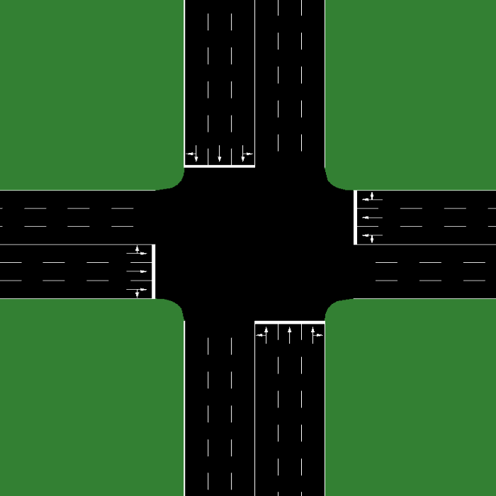
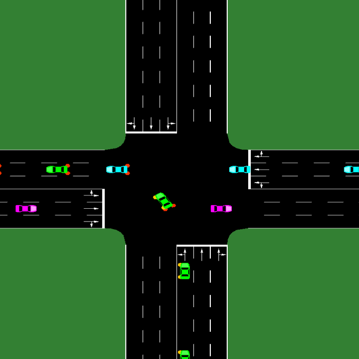
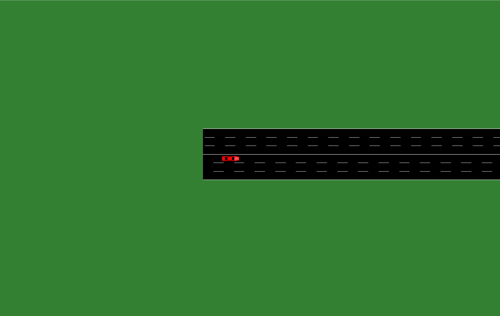

# FNI-RL
This repository is the implementation of our research "**[Fear-Neuro-Inspired Reinforcement Learning for Safe Autonomous Driving](https://www.researchgate.net/publication/374522737_Fear-Neuro-Inspired_Reinforcement_Learning_for_Safe_Autonomous_Driving)**". This research has been published in [IEEE TPAMI](https://ieeexplore.ieee.org/abstract/document/10273631). 

Additionally, FNI-RL has also been featured by IEEE Spectrum Magazine: [Neural Reactions to Fear Make AI Drive More Safely](https://spectrum.ieee.org/autonomous-vehicle-safety-defensive-driving).

## Introduction
### Schematic of the Proposed FNI-RL Framework for Safe Autonomous Driving

In recent years, many neuroscientists have argued that, the specific fear nervous system (i.e., amygdala) in the brain plays a central role, which can predict dangers and elicit defensive behavioral responses against threats and harms; this is crucial for survival in and adaptation to potential risky environments. Additionally, some studies in neuroscience and psychology have highlighted the necessity of actively forecasting hazards or contingencies via world models to ensure the survival of organisms. Motivated by the above insights, we devised a brain-like machine intelligence paradigm by introducing an adversarial imagination mechanism into a constrained reinforcement learning framework, allowing autonomous vehicles to acquire a sense of fear, thereby enhancing or ensuring safety.

## Demonstration
The video demonstration of our work can be found:
[Please click to watch the video](https://www.bilibili.com/video/BV1E34y1T73M/?spm_id_from=333.337.search-card.all.click&vd_source=71620ac61fcf7851589c019bff140478).

In all demonstrations, the red-colored car represents the FNI-RL-driven autonomous vehicle.

###  1. Unprotected left turn task at an unsignalized intersection with oncoming traffic (TrafficEnv1-v0)


###  2. Unprotected right turn task at an unsignalized intersection with crossing traffic (TrafficEnv2-v0)


###  3. Unprotected left turn task at an unsignalized intersection with mixed traffic flows (TrafficEnv3-v0)


###  4. Unprotected crossing negotiation task at an unsignalized intersection with mixed traffic flows (TrafficEnv4-v0)


###  5. Long-term goal-driven navigation task with mixed traffic flows (TrafficEnv5-v0)



## User Guidance
### Installation
This repo is developed using Python 3.7 and PyTorch 1.3.1+CPU in Ubuntu 16.04. 

We utilize the proposed FNI-RL approach to train the autonomous driving agent in the popular [Simulation of Urban Mobility](https://eclipse.dev/sumo/) (SUMO, Version 1.2.0) platform.

We believe that our code can also run on other operating systems with different versions of Python, PyTorch and SUMO, but we have not verified it.

The required packages can be installed using

	pip install -r requirements.txt

### Run
 There are five traffic environments, including four short-distance tasks (TrafficEnv1-v0, TrafficEnv2-v0, TrafficEnv3-v0, and TrafficEnv4-v0) and one long-distance task (TrafficEnv5-v0). 
 For example, users can leverage the following command to run the code in the terminal and train the autonomous driving agent under the unprotected left turn task at an unsignalized intersection with oncoming traffic:

	python run_short_dis_tasks.py --env_name TrafficEnv1-v0
 Users can also use the following command to run the code in the terminal and train the the autonomous driving agent under the long-term goal-driven navigation task with mixed traffic flows:

	python run_long_dis_task.py --env_name TrafficEnv5-v0

## Acknowledgement
We greatly appreciate the important references provided by the two code repositories [SMBPO](https://github.com/gwthomas/Safe-MBPO) and [SAC](https://github.com/denisyarats/pytorch_sac) for the implementation of our research.

## Citation
If you find this repository helpful for your research, we would greatly appreciate it if you could star our repository and cite our work.
```
@ARTICLE{10273631,
  author={He, Xiangkun and Wu, Jingda and Huang, Zhiyu and Hu, Zhongxu and Wang, Jun and Sangiovanni-Vincentelli, Alberto and Lv, Chen},
  journal={IEEE Transactions on Pattern Analysis and Machine Intelligence}, 
  title={Fear-Neuro-Inspired Reinforcement Learning for Safe Autonomous Driving}, 
  year={2024},
  volume={46},
  number={1},
  pages={267-279},
  doi={10.1109/TPAMI.2023.3322426}}
```


